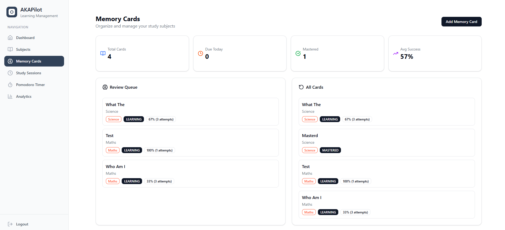

# AKAPILOT

## Built with the tools and technologies:


---
## Youtube Link:

[](https://www.youtube.com/watch?v=hCHW8Leggh0)


## Table of Contents

- [Overview](#overview)
- [Getting Started](#getting-started)
  - [Prerequisites](#prerequisites)
  - [Installation](#installation)
  - [Usage](#usage)

---

## Overview

AKAPilot is an all-in-one platform for building secure, scalable educational and productivity applications. Its modular architecture combines a robust Spring Boot backend with a feature-rich React frontend, enabling seamless data management, user authentication, and interactive UI components. Designed for developers, AKAPilot simplifies the creation of personalized learning experiences, task management, and productivity analytics.


### Why AKAPilot?

This project helps developers craft secure, maintainable, and user-centric learning tools. The core features include:

#### 🔐 User Authentication & Management
Complete user management system with secure registration, login, and profile management. JWT-based authentication with role management and CORS support for safe user interactions.

#### 📚 Subject Management
Organize your learning materials by creating and managing subjects. Users can create, view, update, and delete subjects to categorize their study content effectively.


#### 🃏 Memory Cards (Flashcards)
Interactive flashcard system for effective learning. Create, manage, and review flashcards under specific subjects to enhance memory retention and knowledge recall.



#### 📝 Card Review System
Track your learning progress with comprehensive review history. Monitor flashcard performance, review frequency, and learning patterns to optimize study effectiveness.

#### ⏰ Study Session Tracking
Log and manage study sessions with detailed time tracking. Start and end sessions, monitor study duration, and maintain a comprehensive study history.


#### 🍅 Pomodoro Timer Integration
Built-in Pomodoro technique support within study sessions. Track focused work blocks and breaks to maintain productivity and prevent burnout.


#### ✅ Task Management (To-Do List)
Comprehensive task management system with optional subject linking. Create, organize, and track tasks to stay on top of your learning objectives and assignments.

#### 📈 Analytics & Progress Insights
Comprehensive dashboards and summaries provide actionable insights into user progress, study patterns, and productivity metrics across all features.


---

## Getting Started

### Prerequisites

This project requires the following dependencies:

- **Programming Language:** Java
- **Package Manager:** Maven, Npm

### Installation

Build AKAPilot from the source and install dependencies:

1. **Clone the repository:**

```bash
git clone https://github.com/vidunpriyadarshana/AKAPilot
```

2. **Navigate to the project directory:**

```bash
cd AKAPilot
```

3. **Install the dependencies:**

Using **maven:**

```bash
mvn install
```

Using **npm:**

```bash
npm install
```

### Usage

Run the project with:

Using **maven:**

```bash
mvn exec:java
```

Using **npm:**

```bash
npm start
```
